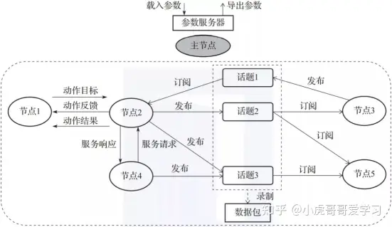

# 该文档总结ROS基础知识点
ROS是分布式通信框架，帮助程序进程间更方便地通信。ROS是运行在ubuntu linux上的亚操纵系统，但是提供硬件抽象，函数调用，进程管理等功能。
## ROS架构
ROS中可执行程序的基本单位是节点node，节点之间通过消息机制进行通信，可以参考下面图片。 
  
节点是可执行程序，也就是进程。节点之间通过收发消息进行通信，分别有三种：
1. topic
2. service
3. action

rosbag是用来保存和回放topic中数据的文件，其实类似于百度自动驾驶项目中的rosbag。参数服务器可以为ros节点提供便于修改的参数，分为静态和动态参数，静态参数一般是节点启动时设置节点工作模式，动态参数可以在运行中动态调整参数，比如电机PID参数。主节点master负责各节点通信过程的调度管理，需要首先启动。

## ROS文件系统
ROS源码是基于catkin编译，而catkin基于CMake，其中CMakeLists.txt负责编译配置

## ROS开源社区

