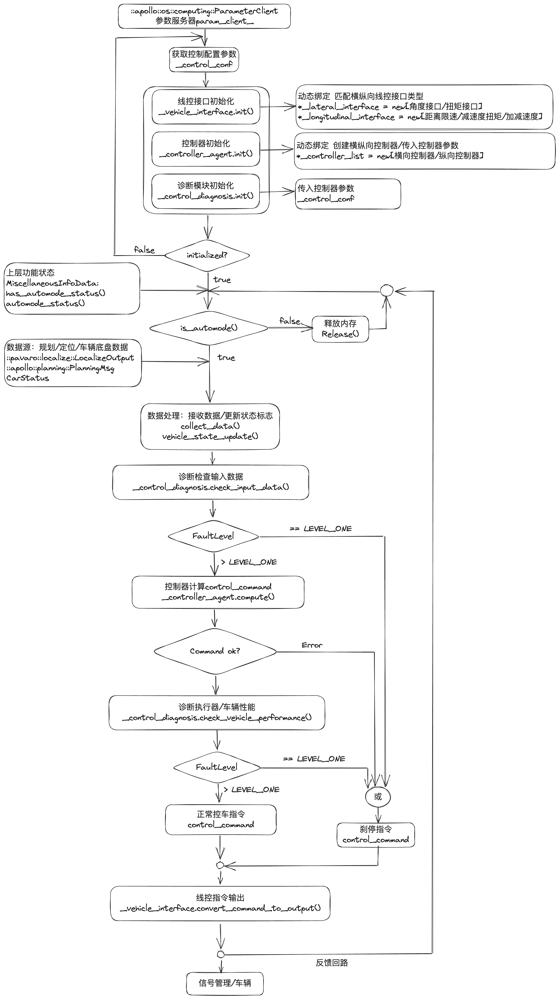

# AVP控制算法和问题总结
该文档整理百度Apollo AVP2控制算法原理，和项目中遇到和解决的问题。
## AVP控制算法
控制算法分为横向控制和纵向控制。百度AVP当前控制算法架构如下：
   
控制算法的输入：
1. Planning下发的轨迹信息（位姿，速度，加速度，曲率，剩余轨迹），理想档位信息
2. ChassisStatus反馈得到的车身信息：档位，转向，驱动制动，轮速，位姿等信息
3. Localization获得的当前车辆位姿，定位车速以及加速度
   
控制算法的输出：
1. 横向：方向盘期望转角
2. 纵向：油门/刹车期望值（根据不同线控接口有所不同）
3. 期望档位位置

### 横向控制
采用动力学曲率前馈+二阶系统反馈的方法，曲率前馈保障响应及时，反馈可以灵敏纠偏。通过产生方向盘指令，实现对规划目标轨迹线的横向位置/角度的跟踪。新的横向控制反馈没有使用apollo传统的LQR方法，而是基于横向运动学关系构建二阶线性关系，设计二阶系统控制律。详情见图片（in Handy）  

### 纵向控制
采用速度环PD控制+ADRC扰动补偿，经典算法稳定可靠。纵向控制器通过输出油门/电机扭矩、减速度（具体要视线控接口而定），控制车辆的加减速，实现车速对规划轨迹参考速度的跟踪。下面具体画两个控制方案
1. 以威马的减速度，电机扭矩接口为例，算法框图如下：   
速度环PD控制器；ADRC控制器对PD加速度指令进行扰动补偿，得到考虑内外扰动的合加速度；若合加速度小于零直接执行减速，若大于零，则进一步考虑纵向受力，解算驱动力矩进行加速。

1. 以集度/毫末的加减速度接口为例，算法框图如下：     
主体算法是自适应PID；目标轨迹加速度作为前馈，通过实际加速度和目标加速度估计路面扰动作为扰动补偿；接近终点通过剩余距离/车速，输出刹停加速度。

### LQR控制算法

### MPC控制算法

### PID调参和ADRC扰动补偿
模糊自适应PID控制器
加减速度接口中的实时扰动观测器

## AVP项目问题总结
### 海马AVP项目问题
1. 方向盘终点不回正问题  
原因：扭矩回滞，传动机械部件/轮胎路感阻力造成泊车完成退出线控后，方向盘反向回弹。   
解决方案：控车最后阶段，原地左右小角度打方向盘（30度），抵消回弹的机械力；但是这种会造成用户体验不是很好。
2. 坡道行驶和停车时顿挫感强烈   
行驶过程中的顿挫感：控制算法超调，导致车速忽快忽慢。主要是在坡道上，驱动和制动两种控制量的特性不同，驱动靠电机正扭矩或重力加速度分量作用很快；在坡道上的加减速不对称也可以理解成，EHB撤销缸压几乎不消耗时间，但是增加缸压过程耗时数百毫秒，困难在此。   
解决方案：按照AVP2中的方案，使用负扭矩代替减速度指令，降低坡道制动延迟；下坡坡道驱动仅靠重力加速度分量实现，降低缸压释放的速度，使得驱动和制动的延迟相等。

顿挫问题在海马项目中频发，主要原因还是加减速延迟时间不同，倒是纵向控制指令无法及时跟上实际的车速。
### 日产AVP项目问题
1. 水平车位撞路沿问题   
水平空间车位撞路沿，主要原因是控制算法横向跟踪精度较差，在方向盘转角给满的情况下仍然无法跟上规划给出的大曲率轨迹。   
具体解决方法如下：1. 降低纵向限速，使得车辆速度降下来，更容易跟上轨迹；2. 增大车辆配置文件中的最小转弯半径，从4.7m增大到5.1m，当时的最小转弯半径是在方向盘打死然后再启动车辆转弯的情况下测量的，没有正确反映双匀速轨迹的特点；3. 适当调整增大横向预瞄距离，让方向盘及时执行转向操作；4. 适当调整前馈的比例，比如从1.0降到0.9，因为100%前馈控制（已知规划轨迹曲率）作用过强。   
双匀速轨迹的生成：建议用更低的方向盘匀转速和更低的匀车速用于生成轨迹，这样轨迹比较平缓，有利于提高控制成功率和准确率。   
日产AVP横向控制是曲率前馈 + 二阶系统反馈设计。
2. 纵向控制不稳定，遇到障碍物没有及时刹停   
日产纵向控制问题比较简单，因为日产接口只有剩余距离和最高限速接口，具体速度控制由日产ESC供应商（很可能是博世）在内部控制；所以百度这边控制算法能做的只有尽量做好分段限速，让速度变化平滑，但是具体到遇到障碍物没有刹停就只能找ESC厂商进行确认。另：距离限速接口在路径终点需要两者同时置零才能使得ESC成功刹停车辆（ESC厂商的要求）。

横向控制问题中需要关注以下几个问题：   
1. EPS转动比是否线性，
2. 左右是否对称   

可以绘制x-steering wheel position，y-front instantaneous steering ratio 这样的图来看上面这两个问题；EPS转向性能会影响横向控制跟随性能以及整体泊车性能。

### CarMaker和算法数据的仿真设计思路
CarMaker在AVP泊车项目中主要是用在规划领域，控制由于关联件建模难度问题，很难准确仿真。具体的仿真设计思路如下：
   
CarMaker通过hellocm这个ros node，通过交换hellocm/in 和 hellocm/out两个信息进行输入输出的数据交换，hellocm将hellocm/in中的信息转换成apollo定义的信息类型。  
我们利用hellocm节点与之通信，图中节点sim_interface是我们设计的ros节点，用于接收感知信息，并转换为c++算法定义的数据结构；图中control_interface节点用于将我们算法输出的控制指令转换成hellocm能够接收的topic即可。   
若用MCU和carmaker进行处理器在环仿真的话，就将FIFO改成Ethernet连接，然后用MCU替换carmaker-sim（也就是我们的算法模块）。

### 对关联件的技术要求
百度AVP系统对各种关联件有性能要求，比如EPS/EHB/VCU/BCM/车机/T-Box/接口定义。

#### FIFO文件是什么？

