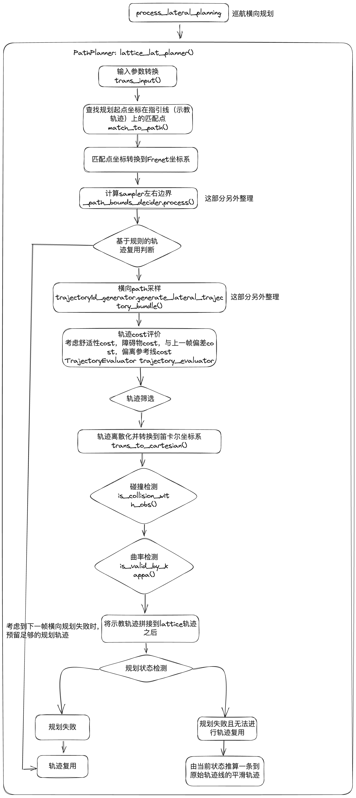
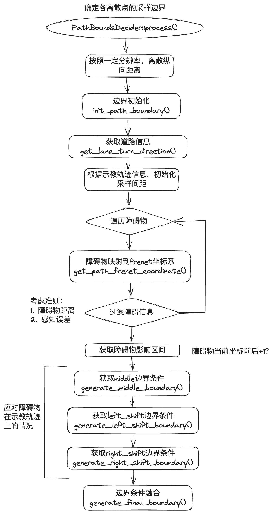
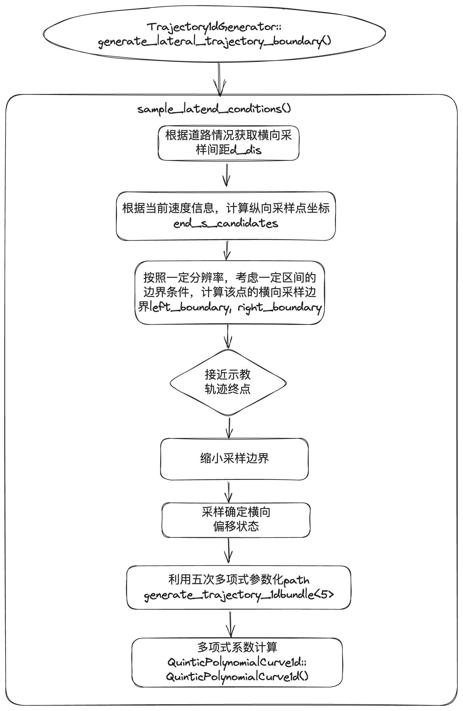
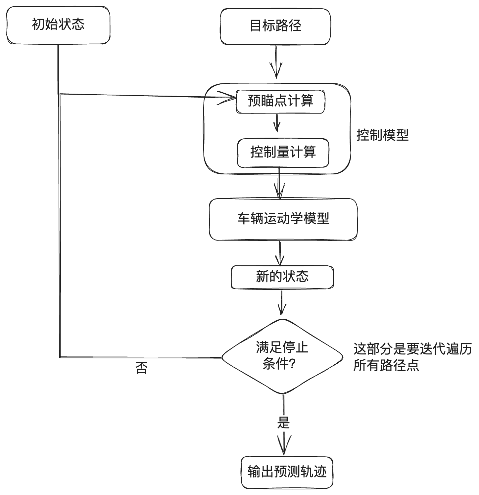
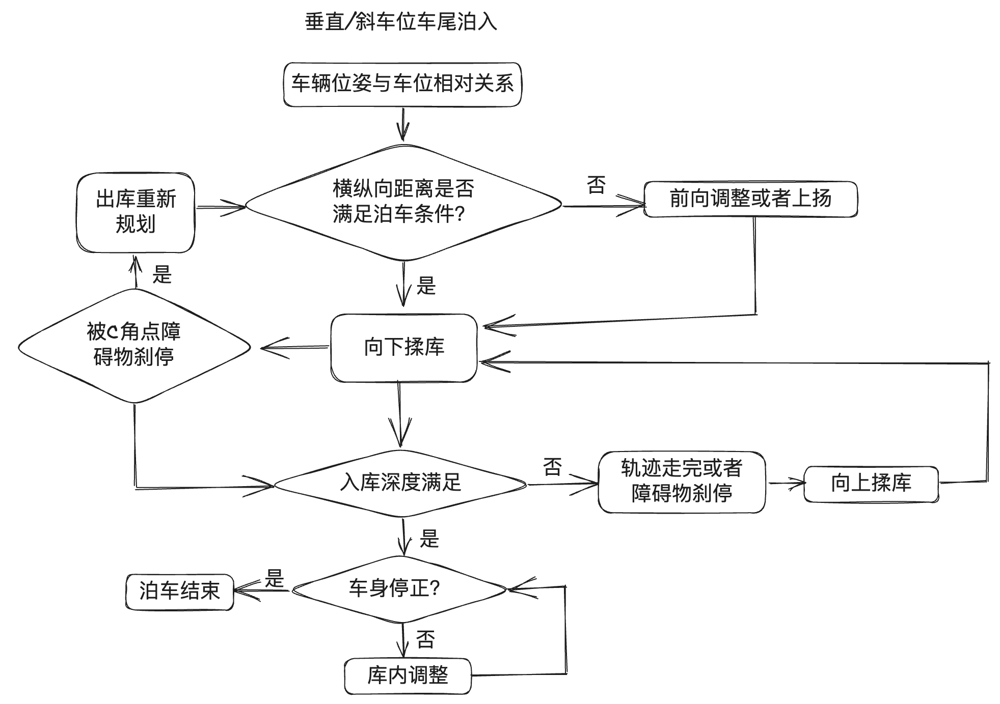
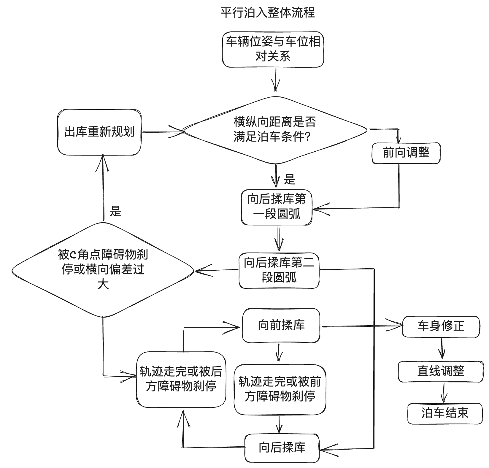
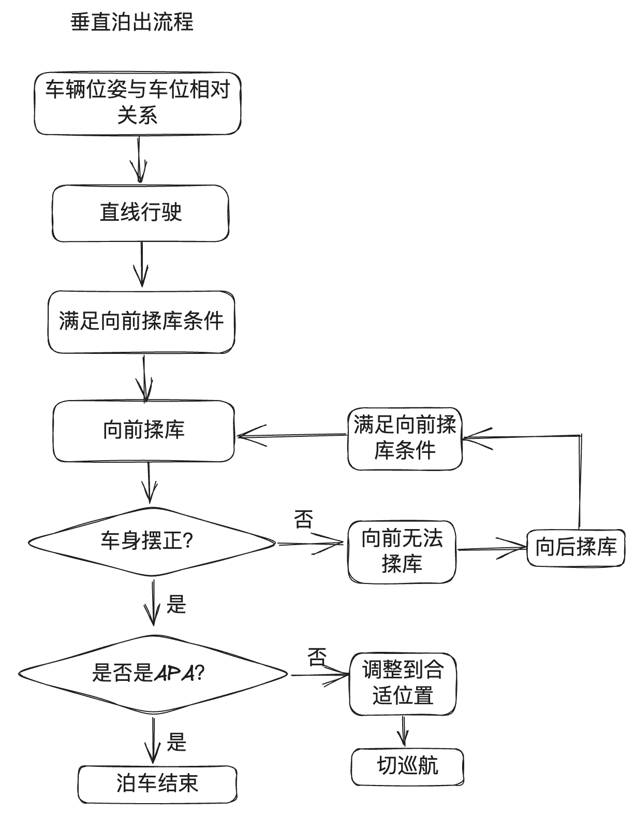

# AVP规划算法和问题总结
该文档总结百度Apollo AVP2规划算法方案，和项目中遇到和解决的问题。

## AVP规划算法
规划算法分为巡航规划和泊车规划，其中巡航规划又分为巡航纵向规划和巡航横向规划。

### 巡航规划
巡航规划采用横纵向解耦的策略，横向规划输出一条安全的动力学可行的轨迹（位置，姿态，曲率），纵向规划在横向轨迹点的基础上增加速度信息，涉及纵向行车安全和体感等方面。
1. 横向规划：采用Apollo经典Lattice算法，即撒点采样+评价筛选，直观简洁，久经验证  
主要算法是单层lattice，在frenet坐标系通过撒点采样和五次多项式参数化得到一组可行解集，利用轨迹评价函数得到最优的备选轨迹。Apollo规划的前提是必须有光滑的指引线，指引线的获取等内容暂时未涉及，可以参考下面链接中的问答：
[Apollo规划算法问答](https://zhuanlan.zhihu.com/p/69878689).  
巡航阶段横向规划的框图可以参考下面图片，输入是障碍物信息/规划起点坐标/车辆状态信息，输出是离散化轨迹

上述子模块之一采样边界确定的大体流程如下，输入是障碍物信息/示教轨迹/规划起点，输出是离散边界条件

上述子模块之二横向采样大体流程如下，输入是边界信息，输出是多项式参数的轨迹集
  
Lattice Planner输出的轨迹是一条光滑无碰撞满足车辆运动学约束和速度约束的平稳安全的局部轨迹。Lattice Planner要注意是局部轨迹规划器，全局轨迹规划  

2. 纵向规划：新方案复用ANP2高斯伪谱，但是老方案还没有加进去   
纵向规划的目的是求出规划轨迹上的速度。  
    2.1. 纵向安全急刹距离 Ssafe = 纵向急刹距离Sstop + 纵向安全冗余距离Sboundary + EM不确定度EMerror; 其中纵向安全冗余距离根据不同类型障碍物和车辆当前巡航状态进行设计，分为巡航状态和绕障状态，分别对行人（如0.8m）/车辆（如0.6m）和其他障碍物（如0.5m）有不同的冗余距离设定；EM不确定度由EM提供；纵向急刹距离由ADAS软件延时距离（取上限）+抱死滑行距离计算得来。  
    2.2. 纵向缓刹区域：阿克曼预测缓刹区域，基于阿克曼运动学模型和车辆周边不同距离，划定不同的区域。图片中（照片）紫蓝区域参与纵向ACC障碍物筛选和轨迹截断。  
    2.3. 纵向跟车方案：输入横向规划结果/当前车速/障碍物信息->根据障碍物位置计算巡航终点->根据动态/静态障碍物计算目标车速->计算目标加速度->计算安全加速度->融合两个加速度merge()->更新最终速度计算update_self_speed()。 ACC速度规划主要是遍历每个轨迹点计算速度和加速度，每个点根据剩余距离和道路曲率，结合lookup_table()计算目标速度。merge()是通过定义ratio来实现的。动态障碍物ACC速度规划简化版如下，根据轨迹点到障碍物的距离$\Delta S_{index}$，使用分段公式计算该轨迹点的最大允许速度$v_{allow}$，小于安全距离为0/安全距离和跟随距离之间就取$min(v_{limit}, v_{obs})$，如果大于跟随距离就直接根据牛顿运动学公式计算速度；再根据轨迹点的曲率进行限速$v_{limit}$；然后取$min(v_{allow}, v_{limit})$。
    2.4. 阿克曼预测缓刹：目的是通过规划路径和车辆状态预测本车接下来将要行驶的路径，作为障碍物筛选的路径。具体流程如下图：  
       
    2.5. 控制模型预瞄点计算：首先计算最近规划点，通过计算车辆位置和规划点之间的距离得到最近规划点；然后计算车辆相对于最近规划点的$\delta s$；然后匹配最近规划点前方$(preview_distance + \delta s)$的规划点，不存在这样的点要进行插值。  
    2.6. 障碍物截断：根据障碍物和车辆轨迹遍历所有的碰撞点，计算sl坐标，得到碰撞点中s最小的点输出给acc，acc中减去预留的安全距离作为路径截断的长度，根据该长度截断路径。

### 泊车规划
泊车规划采用基于双匀速曲线的几何规划算法，利用有限状态机实现揉库动作切换，简单高效省算力；在中高算力平台上可以采用搜索+优化的规控算法，更灵活智能和鲁棒。  
泊车规划的具体实现流程：
1. 环境信息预处理 collect_upstream_data(): 对泊入泊出用到的不同信息处理，包括出入库模式/车位类型/出入库方向/道路中心线和泊出终点等。
2. 规划状态决策 DataUpdate(&_parking_data): 该函数会根据车辆当前所处的状态跳转到对应的跳转函数，用于判断是否更新当前状态。
3. 规划数据收集封装 collect_data(in_parking_data): 把规划用到的数据收集保存，减少频繁的来回调用。
4. 理想轨迹生成 generate_trajectory(): 根据当前车辆状态，调用当前状态下的路径生成方式，生成规划用到的理想轨迹。
5. 根据车速延长轨迹 lengthen_trajectory(): 理想轨迹生成只考虑到实时环境信息，没有考虑到前后帧变化，为避免急刹需要根据速度延长轨迹。
6. 障碍物处理 obs_deal(in_parking_data): 根据理想轨迹筛选最近的点障碍物，根据障碍物类型进行限速和障碍物刹停时的状态跳转条件判断。
7. 障碍物决策 obs_to_trajectory(): 根据最近的点障碍物确定轨迹状态，包括轨迹截断，障碍物刹停；若无障碍物影响则直接使用理想轨迹。
8. 轨迹处理 check_traj_nan(): 轨迹异常检查，判断轨迹是否存在必要字段缺失，或者重复轨迹点（造成除零）等异常。  

泊车规划采用的是基于几何的路径规划方式，路径规划方式主要是圆弧和直线。对于圆弧轨迹需要计算出当前状态下车辆的转弯半径和转向角度，对于直线轨迹要计算出轨迹长度。泊车规划都是根据当前位置实时规划（10Hz），包括直线规划器/圆弧规划器/速度规划。当前规划考虑如下几种状态：   
1. 车尾垂直库和斜库出入库: 直线行驶straight_path_producer.cpp + 圆弧规划rotate_path_producer.cpp
2. 平行库出入库: 直线行驶straight_path_producer_paral.cpp + 圆弧规划rotate_path_producer_paral.cpp
3. 车头斜库出入库: 直线行驶straight_path_producer_heading.cpp + 圆弧规划rotate_path_producer_heading.cpp   

垂直或斜车位车尾泊入整体流程见下图：

平行泊入整体流程见下图：

垂直泊出整体流程见下图：

泊车算法关键几何关系见下图：(in Handy)

泊车和巡航odd: 泊入/泊出/巡航都有对应的odd检测，泊入的odd检测相对复杂，大约考虑一下因素：  
1. 跨层/车和库距离太远
2. 角度偏差较大
3. 路太窄或者有障碍物，揉库空间不足：第一把向前空间不足/上扬空间不足

### 其他规划算法学习
对PNC算法的要求有：算力低，实时性好，可解释性好，可扩展性强，精度高，依赖少。可以学习论文"Practical Search Techniques in Path Planning for Autonomous Driving". 
1. 基于几何分解的方法   
可视图；voronoi；栅格法
2. 基于随机采样的方法   
PRM算法；RRT算法
3. 基于图搜索的方法   
Dijkstra算法；A*算法；D*算法；Hybrid A*   

## AVP项目问题总结
### 海马AVP项目问题
参考绪昌在ASD智驾交付能力建设知识库中总结的海马planning问题
1. 卡障碍物问题   
该问题是实车项目落地过程中规划最常遇到的问题。   
1.1. 垂直车位右后泊入过程中卡C角点：这个问题根因是EM障碍物融合不够精确，可以把绕开C角点的安全距离调大，但是调大之后障碍物精度高的情况下会导致车辆绕行较远 ，边界能力下降。  
1.2. tbd

2. 多次规划问题   
2.1. 平行泊入时，如果车辆后轴中心距离车位中线距离大于某个阈值（比如0.5m），就会触发重新规划，可以改大该阈值，但是在EM车位不稳定的情况下会泊车靠外。   

3. 规划与控制发散造成偏航/规划不平滑导致方向盘抖动（画龙）   
规划路线是实时变化的，相邻帧之间预瞄点曲率/航向误差/横向误差都不一致，会导致方向盘抖动画龙。   
3.1. 缝合轨迹：从上一帧中选取包含车辆后轴中心和预瞄点在内的一段规划线，作为缝合轨迹，以缝合轨迹的最后一个点作为规划起点进行规划。在部分场景需要重规划而不能缝合轨迹：第一帧规划/绕障第一帧/车离规划点太远/速度误差过大/停车时。轨迹缝合方法中，当前帧包含了上一帧的规划信息，上一帧又包含上上帧，相当于考虑了历史规划信息，整个过程连续。   
3.2. lattice轨迹复用：规划失败的时候会复用上一帧的规划结果，截取本车位置之后的部分作为本次规划的输出；这个时候会和缝合轨迹有重合，需要去除重合之后再拼接，轨迹复用逻辑改为规划初始点截取，代替本车位置截取。

4. 水平泊车纵向误差较大   
4.1. 规划策略是stop时离end_point小于某个阈值则泊车完成
4.2. tbd

5. 巡航撞车问题   
车辆减速区设置可能过小，感知精度也不够。

6. 不释放车位问题   
该问题很可能是由于通道过窄，规划判断泊入过程可能会碰撞障碍物，所以没有通过odd检测。

7. 其他问题  
其他有各种各样的问题，比如感知EM误报障碍物，或者是标定不准等问题。

### 日产AVP项目问题
参考绪昌在日产POC项目知识库中的planning问题分析汇总   
日产AVP是AVP2.0，规划轨迹不再是单纯基于几何关系，而是用双匀速曲线（匀车速匀方向盘转速）进行轨迹生成   
1. 方向盘画龙问题   
该问题是因为规划轨迹出现异常突变，从最大曲率突然变成0然后又变成最大，最后导致控制下发方向盘转角忽大忽小，造成画龙现象。详细解释：临近规划终点，末端轨迹点出现曲率为0的情况；解决方案是当车辆未换挡（换挡需要刹停，而刹停是一段曲率为0的直线）且速度大于0时，车辆不会规划新轨迹，而是沿用上一帧的轨迹，这样就防止部分时间点的轨迹点曲率发生突变。
2. 撞阻车器现象   
撞阻车器除了感知识别可能有些问题，另外就是规划设置的路径终点（车辆后轴中心位置）到阻车器的距离可能太小，导致撞阻车器。由于系统延迟，该距离可以适当大一些，防止撞阻车器不良体感   
3. 到达终点再规划问题   
该问题是在规划终点反复前后规划要满足纵向距离要求，这个会导致体感不好，而且考虑到系统延迟的因素，可能最后修正的位置仍然有较大的纵向误差。